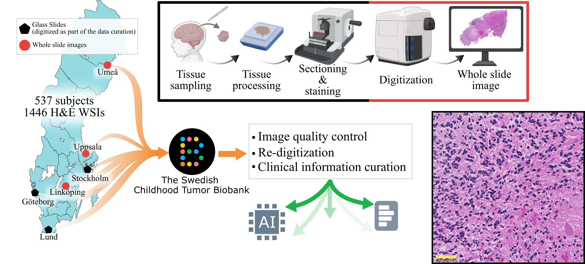

# Barntumorbanken digital histopathology dataset descriptor



[Journal]() | [Cite](#reference)

** Abstract **
Refined detection methods, more detailed tumor characterization, and adequate distinction between different pediatric tumor subtypes are necessary to improve diagnosis and treatment, enable precision medicine, and advance patient prognosis. However, the application of computational approaches to pediatric brain tumors remains limited, largely due to the lack of accessible datasets. 

To address part of this gap, we provide whole slide images (WSIs) of hematoxylin and eosin (H&E)-stained tissue sections from all pediatric central nervous system (CNS) samples collected in Sweden between 2013 and 2023. These data represent a population-based national cohort encompassing all six pediatric oncology centers in Sweden and are available through the Swedish Childhood Tumor Biobank (BTB). The dataset includes 1,446 WSIs of sufficient image quality with confirmed CNS tumor diagnoses, derived from 537 unique subjects (562 cases). In addition, diagnostic-relevant clinical information is included. Corresponding whole-genome sequencing (WGS), whole-transcriptome sequencing (WTS), and methylation array data are available for most tumor samples through separate resources. 

This H&E dataset has been specifically curated to support artificial intelligence-based analyses, while also serving broader applications in medical research and education. When combined with matched molecular data, it provides a valuable resource for advancing multimodal and precision diagnostic approaches in the pediatric population. 
Refined detection methods, more detailed tumor mapping and adequate distinction between different subtypes of pediatric tumors are necessary to improve treatment, enable precision medicine and improve patient prognosis. Application of computational algorithms for pediatric brain tumors is very limited mainly due to the unavailability of pediatric histology brain tumor data sets. To enable the development of AI models comprehensive datasets covering a wide range of pediatric brain tumors are needed. 

## Dataset at a glimps
See the [sunburst diagram](https://medical-image-analysis-group-at-liu.github.io/BTB_dataset_descriptor/) breaking down the hierarchical tumor classification for the samples available in the dataset.

## Reference
If you use this work, please cite:

```bibtex
```

## License
This work is licensed under [Creative Commons Attribution-NonCommercial-ShareAlike 4.0 International](https://creativecommons.org/licenses/by-nc-sa/4.0/).

## Acknowledgments
The authors gratefully acknowledge The Swedish Childhood Tumor Biobank, supported by the Swedish Childhood Fund for access to samples and data. The study was financed by Swedish Childhood Cancer Fund (MT2021-0011, MT2022-0013 (NHH)), Joanna Cocozza’s Foundation for Children’s Medical Research (2023 and 2025 (NHH)); Linköping University’s Cancer Strength Area (2022, 2024), Vinnova project 2017 02447 via Medtech4Health and Analytic Imaging Diagnostics Arena (1908) (NH) and ALF Grants, Region Östergötland (974566) (IB).  

The valuable assistance of the clinical pathology departments and pediatric oncology centers at University Hospitals in Gothenburg, Linköping, Lund, Stockholm, Uppsala and Umeå is gratefully acknowledged. 


